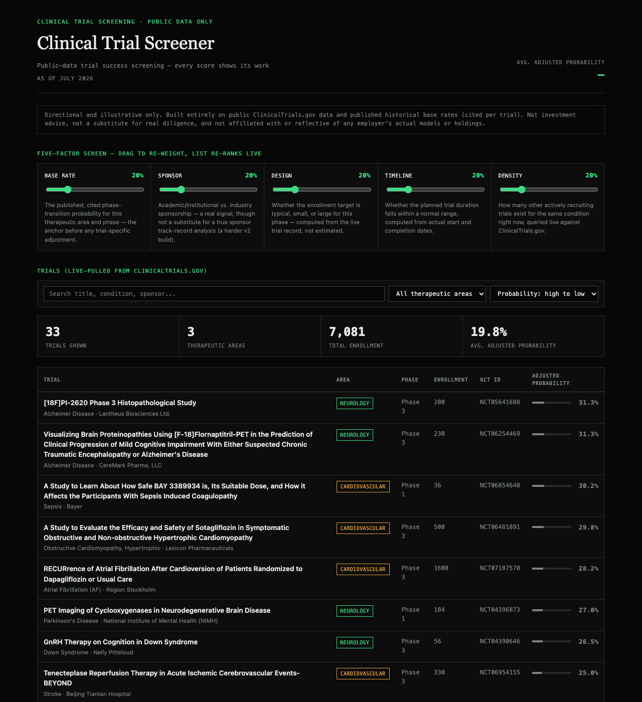

# PhaseSignal — Biotech Trial Success-Probability Tool

**Status:** v1 built and live. 33 real, live-pulled trials across oncology, cardiovascular, and neurology. See [SCOPE.md](SCOPE.md) for the full technical spec and phased roadmap.

**Live:** https://bakulbadwal.github.io/phasesignal/

## Honest positioning

This is not a claim of a blank market — institutional platforms (Evaluate Pharma, Clarivate Cortellis, GlobalData) and at least one AI-native competitor (Intelligencia AI) already work this space, alongside a real body of academic ML research on trial-outcome prediction. The differentiation here is narrower and more honest: fully public data, zero licensing cost, and every score shows exactly which factor moved it — no black box.

## The problem

Estimating a clinical trial's probability of success is currently either manual and expert-dependent (a biotech analyst reading the protocol and comparing it to what they remember) or locked behind expensive institutional data terminals that don't show their work.

## What it is

A screening tool that pulls **real, live trial data** from the ClinicalTrials.gov public API and scores each trial against a **published, cited base rate** (BIO/Informa/QLS Clinical Development Success Rates study, 2011–2020) — adjusted by four computed factors: sponsor profile, trial design (enrollment vs. phase norms), timeline risk, and competitive density (queried live, per trial, against ClinicalTrials.gov). Every number in the app is either pulled live or cited to a real source — nothing is fabricated. A sibling tool to [The Sourcing Screen](https://github.com/bakulbadwal/dealsourcing): same instinct (make a screening framework's assumptions visible and adjustable), applied to a different asset class.

## Data pipeline — and it refreshes itself

`data/build_dataset.py` fetches real trial records live, saves them to `data/raw_*.json` for reproducibility, classifies each trial's sponsor, computes trial-design and timeline signals from the actual record, queries ClinicalTrials.gov live for the current competitive trial count per condition, and writes the scored `data.json` the app reads.

This runs automatically: `.github/workflows/refresh-data.yml` triggers it weekly (Mondays) with zero manual steps — GitHub's own servers pull fresh data, and if anything actually changed, commit and push the update, which auto-deploys to the live site. Commits only happen when the data actually changes, so the history stays meaningful. Trigger a run manually anytime from the repo's Actions tab, or just run `python3 build_dataset.py` locally.

## Why this, why now, why me

This sits at the actual intersection of the two things I have that most people building AI-for-biotech tools don't: real investing/screening judgment from PE work, and enough scientific literacy to know what trial-design factors actually matter. It's not a generic "AI predicts drug approval" pitch — it's a transparent base-rate model, built on real published statistics, that an actual investor would find useful specifically because it shows its work.

## Stack

Vanilla HTML/CSS/JS, data/view split, ClinicalTrials.gov public API as the data source. Full architecture and scoring methodology in [SCOPE.md](SCOPE.md).

## Disclaimer (goes in the app itself, not just here)

Directional and illustrative only, built entirely on public data and published historical base rates — not investment advice, not a substitute for real diligence, and not affiliated with or reflective of any employer's actual models or holdings.

## License

MIT — see [LICENSE](LICENSE).
